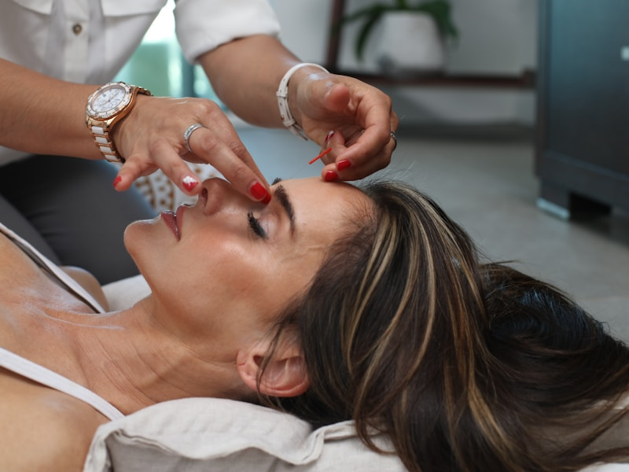
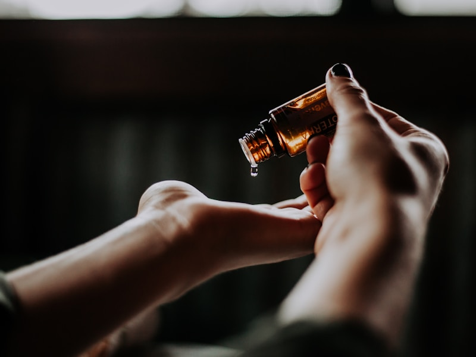

# 🏮 品牌故事

> 玥之韵 · 传承东方美学 · 缔造健康之美



---

## 📖 品牌由来

**玥之韵美容美体养生馆** 创立于 2020 年，品牌名称寓意深远：

- **玥**：古代传说中的神珠，象征珍贵与美好
- **韵**：韵味、气韵，代表东方女性的优雅气质

"玥之韵"意为**如珍宝般呵护每一位女性，让她们绽放独特的韵味与光彩**。

---

## 🌟 品牌理念



### 我们的使命

> 让每一位女性都能拥有健康、自信的美丽

### 核心价值观

| 价值 | 说明 |
|------|------|
| **专业** | 持续学习，精益求精 |
| **诚信** | 价格透明，真诚待人 |
| **品质** | 严选产品，用心服务 |
| **创新** | 与时俱进，追求卓越 |

### 服务理念

```
💝 三心服务标准

❤ 用心：用心对待每一位顾客
❤ 耐心：耐心解答每一个问题
❤ 细心：细心关注每一个细节
```

---

## 🏆 品牌荣誉

### 资质认证

- ✅ 国家美容师职业资格证书
- ✅ 卫生许可证
- ✅ 营业执照
- ✅ ISO9001 质量管理体系认证

### 行业认可

| 年份 | 荣誉 |
|------|------|
| 2024 | 年度最佳美容服务机构 |
| 2023 | 消费者信赖品牌 |
| 2022 | 美容行业示范单位 |
| 2021 | 优秀美容门店 |

---

## 🌿 品牌特色

### 中医养生理念

玥之韵将**传统中医理论**与现代美容技术相结合：

1. **辨证施治**: 根据顾客体质定制方案
2. **内外兼修**: 注重内在调理与外在护理
3. **标本兼治**: 解决表面问题的同时调理根本
4. **预防为主**: 强调日常保养的重要性

### 产品严选

我们只使用**国际一线品牌**和**天然有机产品**：

- 🇫🇷 法国进口护肤品牌
- 🇨🇭 瑞士高端抗衰产品
- 🇯🇵 日本温和护肤系列
- 🇨🇳 中医草本护理产品

---

## 👩‍⚕️ 团队介绍

### 创始人

> **张玥** - 品牌创始人兼技术总监

- 15 年美容行业经验
- 国家高级美容师
- 中医养生指导师
- 多次赴法国、日本进修学习

### 技术团队

| 职位 | 人数 | 资质要求 |
|------|------|----------|
| 高级美容师 | 5 名 | 8 年以上经验 + 高级证书 |
| 美容师 | 10 名 | 5 年以上经验 + 中级证书 |
| 养生调理师 | 3 名 | 中医背景 + 专业认证 |
| 前台顾问 | 4 名 | 专业培训 + 服务经验 |

---

## 📍 发展历程

```
2020 年 ──▶ 首家门店开业
    │
    ├─▶ 2021 年 ──▶ 会员突破 1000 人
    │
    ├─▶ 2022 年 ──▶ 荣获行业示范单位
    │
    ├─▶ 2023 年 ──▶ 开设第二家分店
    │
    └─▶ 2024 年 ──▶ 会员突破 5000 人
```

---

## 🎯 未来愿景

### 短期目标 (1-2 年)

- [ ] 开设 3-5 家连锁门店
- [ ] 会员数量突破 10000 人
- [ ] 建立专业培训学院

### 长期目标 (3-5 年)

- [ ] 成为区域领先美容品牌
- [ ] 开发自有产品线
- [ ] 建立线上商城平台

---

## 💝 社会责任

玥之韵积极履行社会责任：

- 🌱 使用环保产品，减少塑料浪费
- 👩‍🎓 提供美容师培训就业机会
- 💕 定期举办公益美容活动
- 🎓 资助贫困学生完成学业

---

## 📞 联系我们

<div class="admonition info" >
<span class="admonition-title">📍 门店信息</span>

**地址**: [您的详细地址]  
**电话**: 400-xxx-xxxx  
**微信**: yuezhiyun_beauty  
**邮箱**: contact@yuezhiyun.com

</div>

<a href="../booking/online.md" class="md-button md-button--primary">**👉 立即预约体验**</a>

---

*玥之韵美容美体养生馆 - 传承东方美学 · 缔造健康之美*
