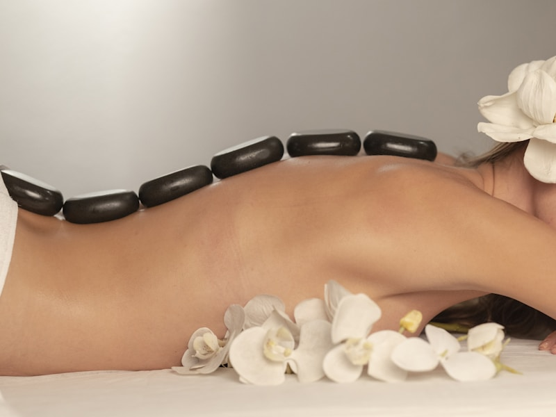
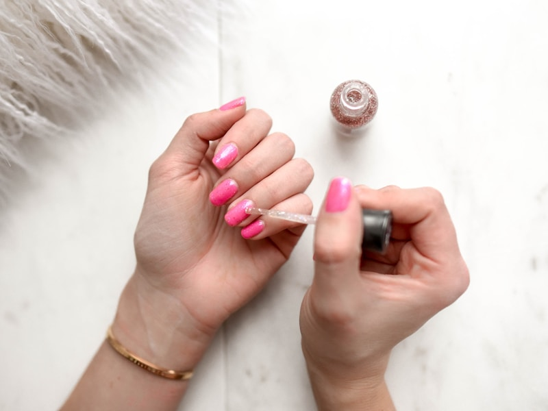
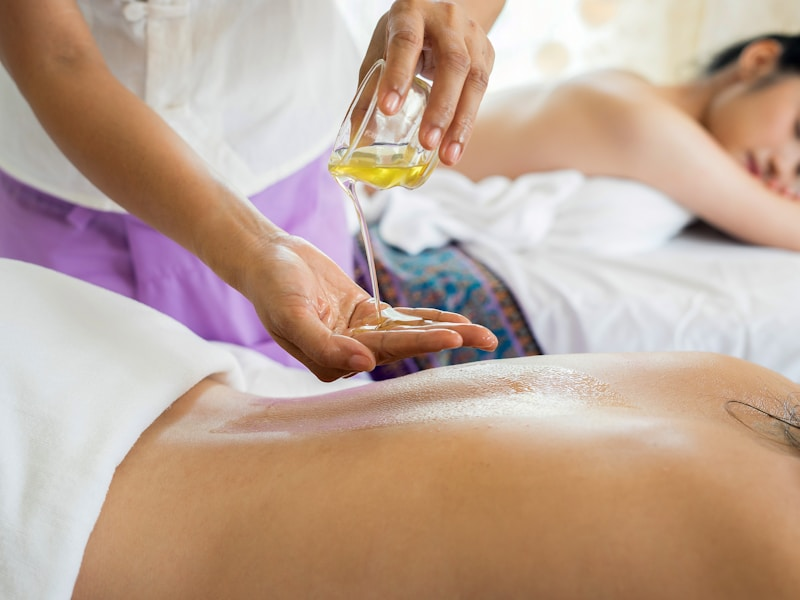

# 玥之韵美容美体养生馆

> 专业美容 · 健康养生 · 品质生活

---

{ style="width: 100%; max-height: 500px; object-fit: cover; border-radius: 8px;" }

# 让美丽与健康同行

### 玥之韵 - 15 年专业美容养生专家

[立即预约](booking/online.md){ .md-button .md-button--primary }  [新客专享 99 元体验券](#promotion)

---

## 核心服务项目

-   :material-face-woman: **面部护理**

    ---

    深层清洁、抗衰紧致、痘痘肌调理、敏感肌修复
    
    6 大系列 | 12 个专业项目
    
    [查看详情](services/facial.md){ .md-button }

-   :material-spa: **身体护理**

    ---

    全身精油 SPA、中式推拿、排毒淋巴引流、热石理疗
    
    4 大系列 | 10 个专业项目
    
    [查看详情](services/body.md){ .md-button }

-   :material-leaf: **养生调理**

    ---

    中医体质辨识、经络调理、艾灸养生、拔罐理疗
    
    4 大系列 | 8 个专业项目
    
    [查看详情](services/wellness.md){ .md-button }

-   :material-star: **特色项目**

    ---

    黄金焕肤、瑞士抗衰、产后修复、瘦身塑形
    
    高端定制 | 私人专属
    
    [查看详情](services/special.md){ .md-button }

[查看全部服务项目](services/facial.md){ .md-button }

---

## 品牌资质认证

{ style="width: 100%; max-height: 300px; object-fit: cover; border-radius: 8px; margin: 20px 0;" }

🏆
**ISO9001 质量认证**
国际质量管理体系认证
[查看证书](about/certification.md)

🏥
**卫生评级 A 级**
医疗卫生标准认证
[查看证书](about/certification.md)

📋
**美容行业协会会员**
中国美容美发协会
[查看证书](about/certification.md)

⭐
**消费者信赖品牌**
2023-2024 连续获奖
[查看证书](about/certification.md)

[查看全部资质认证](about/certification.md){ .md-button }

---

## 优雅环境展示

{ style="width: 100%; border-radius: 6px;" }
{ style="width: 100%; border-radius: 6px;" }
{ style="width: 100%; border-radius: 6px;" }
{ style="width: 100%; border-radius: 6px;" }

温馨舒适的环境，医疗级消毒标准，让您安心享受美丽时光

---

## 专业技师团队

{ .team-photo }

#### 张玥 | 技术总监

**从业 15 年** | 国家高级美容师证（编号 XXX123）

**擅长项目**: 抗衰紧致护理、敏感肌修复

**案例分享**: 王女士（45 岁），护理 3 个月，细纹淡化 60%，肌肤紧致度提升 45%

{ .team-photo }

#### 李娜 | 高级美容师

**从业 8 年** | 国家中级美容师证（编号 XXX456）

**擅长项目**: 痘痘肌调理、深层清洁补水

**案例分享**: 陈小姐（28 岁），护理 2 个月，痘痘复发率降低 80%，毛孔缩小 35%

[查看全部技师团队](about/team.md){ .md-button }

---

## 顾客真实评价

★★★★★

> 在这里做了 3 年抗衰护理，效果真的很明显。美容师很专业，会根据皮肤状态调整方案。环境也好，每次来都很放松。
> 
> <cite>— 王女士 · 45 岁 · VIP 会员 · 护理 3 年</cite>

★★★★★

> 价格透明，没有强制消费。美容师手法专业，做完脸皮肤明显变好了。已经推荐给朋友了。
> 
> <cite>— 李女士 · 38 岁 · 忠实顾客 · 护理 1 年</cite>

★★★★★

> 中医养生调理很专业，亚健康改善了很多。老师会详细讲解体质和调理方案，很放心。
> 
> <cite>— 张女士 · 52 岁 · 养生会员 · 护理 2 年</cite>

★★★★★

> 第一次来体验 99 元新客套餐，没想到这么划算。美容师很耐心，效果也好，已经办卡了。
> 
> <cite>— 陈小姐 · 28 岁 · 新顾客 · 首次体验</cite>

[查看更多顾客评价](reviews.md){ .md-button }

---

{ style="width: 100%; max-height: 300px; object-fit: cover; border-radius: 8px; margin: 20px 0;" }

## 限时优惠活动

🎁 新客专享

**首次到店体验价 99 元**（原价 298 元）
- 深层清洁补水护理（60 分钟）
- 免费皮肤检测一次
- 精美礼品一份
- 会员专属优惠券礼包

[立即领取](booking/online.md){ .md-button }

### 春季焕肤套餐

**原价 ¥1980 | 限时 ¥1680**（立减 300 元）

包含项目:
- 深层清洁补水 × 2 次
- 抗衰老紧致护理 × 2 次
- 肩颈放松按摩 × 2 次

有效期：3 个月 | 限本人使用

[立即抢购](pricing/member.md){ .md-button }

{ style="width: 100%; max-height: 300px; object-fit: cover; border-radius: 8px; margin: 20px 0;" }

---

## 会员权益体系

-   :material-medal: **银卡会员**

    ---

    充值 3000 元
    
    - 消费享 9 折
    - 生日免费护理 1 次
    - 优先预约技师
    - 会员专属礼品

-   :material-star: **金卡会员**

    ---

    充值 10000 元
    
    - 消费享 85 折
    - 专属美容顾问
    - 免费产品体验
    - 生日豪华护理

-   :material-diamond: **钻石会员**

    ---

    充值 20000 元
    
    - 消费享 8 折
    - VIP 专属房间
    - 私人定制方案
    - 全年无限次预约

[了解会员详情](pricing/member.md){ .md-button }

---

## 预约方式

-   :material-phone: **电话预约**

    ---

    **400-xxx-xxxx**
    
    10:00-22:00（全年无休）
    
    [立即拨打](tel:400-xxx-xxxx)

-   :material-message: **微信预约**

    ---

    **yuezhiyun_beauty**
    
    扫码添加客服
    
    24 小时在线回复

-   :material-calendar-plus: **在线预约**

    ---

    填写预约表单
    
    4 步快速完成
    
    [立即预约](booking/online.md)

---

## 开启您的美丽之旅

**专业团队 · 高端产品 · 贴心服务**

[立即预约](booking/online.md){ .md-button .md-button--primary style="font-size: 18px; padding: 18px 50px;" }

[查看价格](pricing/member.md){ .md-button style="font-size: 18px; padding: 18px 50px;" }

---

*最后更新：2026-03-13 | 玥之韵美容美体养生馆 版权所有*

---

[隐私政策](privacy.md) | [服务条款](terms.md) | [免责声明](disclaimer.md)

---

## 预约悬浮框

#### 📅 紧急预约

**1 小时内可约时段**:
- 14:00 张玥（可约）
- 15:00 李娜（可约）
- 19:00 李娜（可约）

**热门技师**:
- 🔥 张玥（抗衰专家）
- ⭐ 李娜（祛痘专家）

[立即预约](booking/online.md){ .float-btn }

[电话咨询](tel:400-xxx-xxxx)

