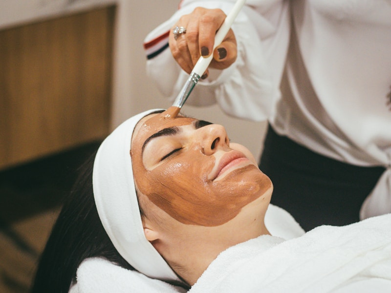

# 会员体系

> 充值享折扣 · 专属权益 · 尊贵体验

---

## 会员等级权益

-   :material-medal: **银卡会员**

    ---

    ### 充值 3000 元
    
    #### 核心权益
    
    - :material-percent: 消费享 **9 折**
    - :material-cake-variant: 生日免费护理 1 次
    - :material-calendar-clock: 优先预约技师
    - :material-gift: 会员专属礼品
    
    #### 额外福利
    
    - 新品体验优先权
    - 会员日双倍积分
    - 推荐好友返现 100 元
    
    [立即办理](#){ .md-button }

-   :material-star: **金卡会员**

    ---

    ### 充值 10000 元
    
    #### 核心权益
    
    - :material-percent: 消费享 **85 折**
    - :material-face-woman: 专属美容顾问
    - :material-spa: 免费产品体验
    - :material-cake: 生日豪华护理
    
    #### 额外福利
    
    - 季度皮肤检测
    - 专属护肤方案
    - 推荐好友返现 300 元
    - 年度感恩礼品
    
    [立即办理](#){ .md-button .md-button--primary }

-   :material-diamond: **钻石会员**

    ---

    ### 充值 20000 元
    
    #### 核心权益
    
    - :material-percent: 消费享 **8 折**
    - :material-door: VIP 专属房间
    - :material-account-tie: 私人定制方案
    - :material-infinity: 全年无限次预约
    
    #### 额外福利
    
    - 月度上门护理
    - 高端产品试用
    - 推荐好友返现 500 元
    - 年度奢华旅游
    
    [立即办理](#){ .md-button .md-button--primary }

---

## 会员充值优惠

### 限时充值活动

| 充值金额 | 赠送金额 | 实际到账 | 相当于 |
|---------|---------|---------|--------|
| ¥3,000 | ¥500 | ¥3,500 | **86 折** |
| ¥5,000 | ¥1,000 | ¥6,000 | **83 折** |
| ¥10,000 | ¥2,500 | ¥12,500 | **80 折** |
| ¥20,000 | ¥6,000 | ¥26,000 | **77 折** |

[立即充值](#){ .md-button .md-button--primary style="font-size: 18px; padding: 16px 50px;" }

🎁 新客专享

首次充值额外赠送：
- 充值 3000+ 送价值 298 元护理 1 次
- 充值 10000+ 送价值 688 元身体护理 2 次
- 充值 20000+ 送价值 1980 元奢华套餐 1 次

---

## 会员专属服务

-   :material-calendar-check: **优先预约**

    ---

    热门技师优先约
    黄金时段优先选
    紧急预约优先排

-   :material-gift: **生日礼遇**

    ---

    银卡：免费护理 1 次
    金卡：豪华护理 + 礼品
    钻石：奢华护理 + 旅游

-   :material-account-group: **专属顾问**

    ---

    金卡及以上专属
    一对一服务
    个性化方案定制

-   :material-shopping: **产品折扣**

    ---

    银卡 9 折
    金卡 85 折
    钻石 8 折

---

## 会员成长体系

### 积分规则

| 消费金额 | 获得积分 | 积分用途 |
|---------|---------|---------|
| ¥1 元 | 1 积分 | 兑换护理项目 |
| 推荐好友 | 500 积分 | 兑换产品 |
| 生日月 | 双倍积分 | 兑换优惠券 |
| 会员日 | 双倍积分 | 兑换礼品 |

### 积分兑换

- 1000 积分 = ¥100 护理券
- 3000 积分 = ¥350 身体护理
- 5000 积分 = ¥600 奢华护理
- 10000 积分 = ¥1500 年度套餐

---

## 会员故事

★★★★★

> 在这里充值成为金卡会员 2 年了，美容师很专业，每次来都很放松。积分兑换也很划算，已经推荐了好几个朋友。
> 
> <cite>— 王女士 · 金卡会员 · 会员 2 年</cite>

★★★★★

> 钻石会员权益真的很超值，专属房间很私密，私人定制方案效果也好。虽然充值多，但算下来很划算。
> 
> <cite>— 李女士 · 钻石会员 · 会员 3 年</cite>

---

## 常见问题

会员有效期

会员资格永久有效，充值金额无使用期限。

退款政策

支持退款，按实际消费次数扣除（原价计算），剩余金额退还。

会员转让

会员资格可转让 1 次，需到前台办理手续。

价格调整

会员充值金额永久有效，价格调整不影响已购套餐。

---

## 办理流程

-   :material-numeric-1-circle: **到店咨询**

    ---

    了解会员权益
    选择合适等级
    专业顾问讲解

-   :material-numeric-2-circle: **填写信息**

    ---

    建立会员档案
    皮肤检测分析
    制定护理方案

-   :material-numeric-3-circle: **充值办理**

    ---

    多种支付方式
    开具会员凭证
    激活会员权益

-   :material-numeric-4-circle: **开始享受**

    ---

    预约护理服务
    使用会员权益
    积分兑换礼品

---

## 成为会员 尊享专属权益

[立即办理](#){ .md-button .md-button--primary style="font-size: 18px; padding: 18px 50px;" }

[咨询客服](tel:400-xxx-xxxx){ .md-button style="font-size: 18px; padding: 18px 50px;" }

---

*会员权益最终解释权归玥之韵所有*
